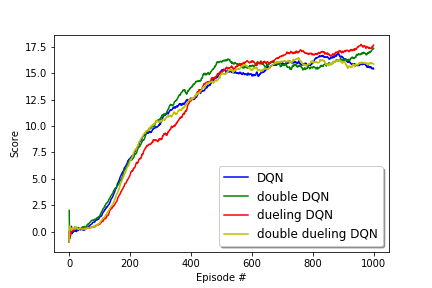

## Navigation Project

### Introduction

In this project, an agent is trained using deep reinforcement learning to navigate an environment. The agent's goal is to collect as many yellow bananas as possible and avoid the blue bananas. Therefore, a reward of +1 is given for each yellow banana and -1 is given for each blue banana. 
The state space of the agent has 37 dimensions including agents speed and perception of the objects in its forward path. The agent has four actions including forward, backward left and right which are denoted by 0, 1, 2, 3 respectively. The task is episodic, and in order to solve the environment, your agent must get an average score of +13 over 100 consecutive episodes

### Deep Q-Learning

Due to the large size of the state space, a neural network is used for estimating Q values for each action based on the state. First, a simple DQN is implemented which includes all fully connected layers with two hidden layers each with 64 and 32 neurons. The hyper parameters of the network are given as follows:

* BUFFER_SIZE = int(1e5)  
* BATCH_SIZE = 64         
* GAMMA = 0.99            
* TAU = 1e-3              
* LR = 5e-4               
* UPDATE_EVERY = 4
* epsilon decay rate = 0.992

This network was simulated with various values for `espilon decay` and the results showed that a smaller rate leads to faster training.

### Deep Q-Learning Improvements
Some modifications are proposed in the literature for better performance of the DQN:

#### Double DQN
However, studies have shown that DQN sometimes overestimates the Q values, specially in the earlier episodes. The reason is that in early stages Q-values are still evolving, so greedily choosing an action that maximizes the Q function does not lead to an accurate estimation. Double DQN arcitecture is proposed to improve the generality of the learning.

#### Dueling DQN
In dueling DQN, has two seperate estimators for state value functions and state dependent action advantage. This architecute allows generalized learning across actions without imposing changes to thereinforcement learning algorithm.

#### Double Dueling DQN
This architecture is a combination of double DQN and Dueling DQN.

### Simulation Results

| Network Architecture 	| Solved at Episode 	|
|----------------------	|-------------------	|
| Vanilla DQN          	|      324             	|
| Double DQN           	|      267             	|
| Dueling DQN          	|       319          	|
| Double Dueling DQN   	|       318            	|

The results show that Double DQN has the fastest learning speed and reaches score of 13 in 267 episodes.
Also the average score per episode is plotted below for all the architectures and it can be seen that the dueling and double DQN have slightly improved the learning convergence of the DQN.

### Further Improvements and Future Work

In order to improve the learning perfromance, a DQN with convolutional neural networks can be implemented to learn from pixels. Therefore it can better navigate in the environment and collect yellow bananas.
